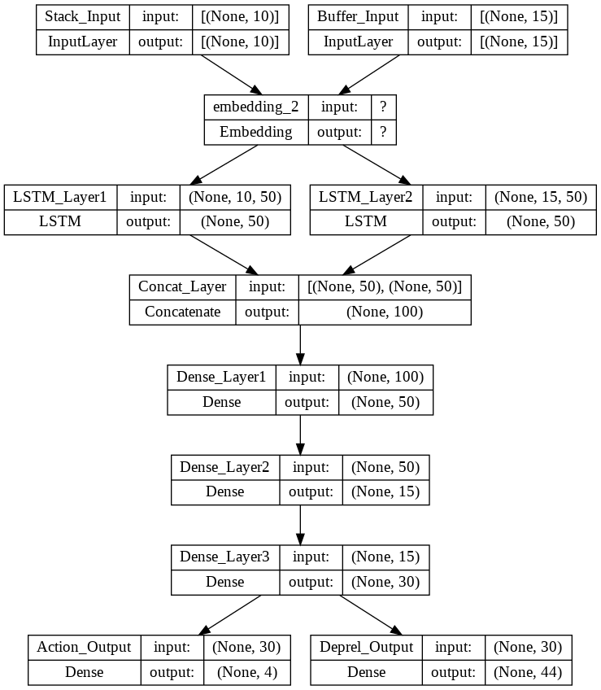

# P2 - Arquitectures

**Students:** Maximiliano Hormazábal - Mutaz Abueisheh

This project is available on GitHub. [Click here to go to the repository](https://github.com/maxhormazabal/depencendy_parsing)

This document shows the different architectures tested for the prediction of arcs and dependencies in the context of dependency parsing. The objective is to highlight different alternatives taken to decide the architecture to be carried out.

## 1. Model A

- Main features: LSTM
- Contains UPOS: No
- Number of entries: 2
- Number of outputs: 2
- Approximate performance: `Action_Output_accuracy: 0.7487 - Deprel_Output_accuracy: 0.6271`

```python
embedd_output = 50
action_shape = action_train[0].shape[0]
deprel_shape = deprel_train[0].shape[0]

input1 = tf.keras.layers.Input(shape=(stack_len,),name = 'Stack_Input')
input2 = tf.keras.layers.Input(shape=(buffer_len,),name = 'Buffer_Input')

embedding_layer = tf.keras.layers.Embedding(n_token+1, embedd_output,mask_zero=True)
input1_embedded = embedding_layer(input1)
input2_embedded = embedding_layer(input2)

lstm1 = tf.keras.layers.LSTM(embedd_output,return_sequences=False,name="LSTM_Layer1")(input1_embedded)
lstm2 = tf.keras.layers.LSTM(embedd_output,return_sequences=False,name="LSTM_Layer2")(input2_embedded)

merged = tf.keras.layers.Concatenate(axis=1,name = 'Concat_Layer')([lstm1, lstm2])
dense1 = tf.keras.layers.Dense(50, activation='sigmoid', use_bias=True,name = 'Dense_Layer1')(merged)
dense2 = tf.keras.layers.Dense(15, input_dim=1, activation='relu', use_bias=True,name = 'Dense_Layer2')(dense1)
dense3 = tf.keras.layers.Dense(30, input_dim=1, activation='relu', use_bias=True,name = 'Dense_Layer3')(dense2)
output1 = tf.keras.layers.Dense(action_shape, activation='softmax', use_bias=True,name = 'Action_Output')(dense3)
output2 = tf.keras.layers.Dense(deprel_shape, activation='softmax', use_bias=True,name = 'Deprel_Output')(dense3)

model = tf.keras.Model(inputs=[input1,input2],outputs=[output1,output2])

opt = tf.keras.optimizers.Adam(learning_rate=0.001)

model.compile(loss='categorical_crossentropy',optimizer=opt,metrics=['accuracy'])

tf.keras.utils.plot_model(model,show_shapes=True)
```

This is a neural network architecture has two inputs (stack_len,) and (buffer_len,) respectively. These inputs are passed through an embedding layer, which maps each input value to a 50-dimensional vector. The output of the embedding layer for each input is then passed through a separate LSTM layer. The output of these LSTM layers is then concatenated along the last axis and passed through three dense (fully-connected) layers. Finally, the output of the third dense layer is passed through two separate dense layers, producing two output tensors with shapes (action_shape,) and (deprel_shape,) respectively. The model is compiled with the Adam optimizer and the categorical cross-entropy loss function.



## 2. Model B

- Main features: No LSTM, Embedding layer for each variable, Flatten layer
- Contains UPOS: No
- Number of entries: 2
- Number of outputs: 
- Approximate performance: `output_action_accuracy: 0.7220 - output_deprel_accuracy: 0.6392`

```python
stack_shape = stack_len
buffer_shape = buffer_len
action_shape = action_train[0].shape[0]
deprel_shape = deprel_train[0].shape[0]
num_tokens = n_token
embedding_stack_dim = 30
embedding_buffer_dim = 50

input_stack = tf.keras.layers.Input(shape=(stack_shape,), name='stack_input')
input_buffer = tf.keras.layers.Input(shape=(buffer_shape,), name='buffer_input')

embedding_stack_layer = tf.keras.layers.Embedding(num_tokens+1, embedding_stack_dim,mask_zero = True)
embedding_buffer_layer = tf.keras.layers.Embedding(num_tokens+1, embedding_buffer_dim,mask_zero = True)

embedded_stack = embedding_stack_layer(input_stack)
embedded_buffer = embedding_buffer_layer(input_buffer)

flat_stack = tf.keras.layers.Flatten()(embedded_stack)
flat_buffer = tf.keras.layers.Flatten()(embedded_buffer)

merged = tf.keras.layers.Concatenate()([flat_stack, flat_buffer])

dense_action = tf.keras.layers.Dense(64, activation='relu',name = "dense_action")(merged)
dense_deprel = tf.keras.layers.Dense(64, activation='relu',name = "dense_deprel")(merged)

output_action = tf.keras.layers.Dense(action_shape, activation='softmax', name='output_action')(dense_action)
output_deprel = tf.keras.layers.Dense(deprel_shape, activation='softmax', name='output_deprel')(dense_deprel)

model = tf.keras.Model(inputs=[input_stack, input_buffer], outputs=[output_action, output_deprel])

opt = tf.keras.optimizers.Adam(learning_rate=0.001)

model.compile(loss='categorical_crossentropy',optimizer=opt,metrics=['accuracy'])

tf.keras.utils.plot_model(model,show_shapes=True)
```

The inputs are passed through separate embedding layers, which map each input value to a 30-dimensional vector and a 50-dimensional vector, respectively. The output of these embedding layers is then flattened and concatenated. The concatenated output is passed through two separate dense (fully-connected) layers, and the output of these layers is passed through two separate dense layers that produce two output tensors with shapes (action_shape,) and (deprel_shape,) respectively. The model is compiled with the Adam optimizer and the categorical cross-entropy loss function.


## 3. Model C

- Main features: Max Pooling instead of Flatten layer
- Contains UPOS: No
- Number of entries: 2
- Number of outputs: 2
- Approximate performance: `output_action_accuracy: 0.7280 - output_deprel_accuracy: 0.6416` 

```python
stack_shape = stack_len
buffer_shape = buffer_len
action_shape = action_train[0].shape[0]
deprel_shape = deprel_train[0].shape[0]
num_tokens = n_token
embedding_stack_dim = 30
embedding_buffer_dim = 50

input_stack = tf.keras.layers.Input(shape=(stack_shape,), name='stack_input')
input_buffer = tf.keras.layers.Input(shape=(buffer_shape,), name='buffer_input')

embedding_stack_layer = tf.keras.layers.Embedding(num_tokens+1, embedding_stack_dim,mask_zero = True)
embedding_buffer_layer = tf.keras.layers.Embedding(num_tokens+1, embedding_buffer_dim,mask_zero = True)

embedded_stack = embedding_stack_layer(input_stack)
embedded_buffer = embedding_buffer_layer(input_buffer)

lstm_stack = tf.keras.layers.LSTM(embedding_stack_dim,return_sequences=False,name="LSTM_stack")(embedded_stack)
lstm_buffer = tf.keras.layers.LSTM(embedding_buffer_dim,return_sequences=False,name="LSTM_buffer")(embedded_buffer)

flat_stack = tf.keras.layers.Flatten()(embedded_stack)
flat_buffer = tf.keras.layers.Flatten()(embedded_buffer)

merged = tf.keras.layers.Concatenate()([lstm_stack, lstm_buffer])

dense_action = tf.keras.layers.Dense(64, activation='relu',name = "dense_action")(merged)
dense_deprel = tf.keras.layers.Dense(64, activation='relu',name = "dense_deprel")(merged)

output_action = tf.keras.layers.Dense(action_shape, activation='softmax', name='output_action')(dense_action)
output_deprel = tf.keras.layers.Dense(deprel_shape, activation='softmax', name='output_deprel')(dense_deprel)

model = tf.keras.Model(inputs=[input_stack, input_buffer], outputs=[output_action, output_deprel])

opt = tf.keras.optimizers.Adam(learning_rate=0.001)

model.compile(loss='categorical_crossentropy',optimizer=opt,metrics=['accuracy'])

tf.keras.utils.plot_model(model,show_shapes=True)
```

The inputs are passed through separate embedding layers, which map each input value to a 30-dimensional vector and a 50-dimensional vector, respectively. The output of these embedding layers is then passed through separate LSTM layers. The output of these LSTM layers is then concatenated and passed through two separate dense (fully-connected) layers. Finally, the output of these dense layers is passed through two separate dense layers that produce two output tensors with shapes (action_shape,) and (deprel_shape,) respectively. The model is compiled with the Adam optimizer and the categorical cross-entropy loss function.


## 4. Model D

- Main features: UPOS included
- Contains UPOS: Yes
- Number of entries: 4
- Number of outputs: 2
- Approximate performance: `output_action_accuracy: 0.7513 - output_deprel_accuracy: 0.6628`  

```python
stack_shape = stack_len
buffer_shape = buffer_len
action_shape = action_train[0].shape[0]
deprel_shape = deprel_train[0].shape[0]
num_tokens = n_token
embedding_stack_dim = 30
embedding_buffer_dim = 50

input_stack = tf.keras.layers.Input(shape=(stack_shape,), name='stack_input')
input_buffer = tf.keras.layers.Input(shape=(buffer_shape,), name='buffer_input')

input_upos_stack = tf.keras.layers.Input(shape=(stack_shape,), name='upos_stack_input')
input_upos_buffer = tf.keras.layers.Input(shape=(buffer_shape,), name='upos_buffer_input')

embedding_stack_layer = tf.keras.layers.Embedding(num_tokens+1, embedding_stack_dim,mask_zero = True)
embedding_buffer_layer = tf.keras.layers.Embedding(num_tokens+1, embedding_buffer_dim,mask_zero = True)

embedding_upos_stack_layer = tf.keras.layers.Embedding(num_tokens+1, embedding_stack_dim,mask_zero = True)
embedding_upos_buffer_layer = tf.keras.layers.Embedding(num_tokens+1, embedding_buffer_dim,mask_zero = True)

embedded_stack = embedding_stack_layer(input_stack)
embedded_buffer = embedding_buffer_layer(input_buffer)

embedded_upos_stack = embedding_upos_stack_layer(input_upos_stack)
embedded_upos_buffer = embedding_upos_buffer_layer(input_upos_buffer)

flat_stack = tf.keras.layers.Flatten()(embedded_stack)
flat_buffer = tf.keras.layers.Flatten()(embedded_buffer)

flat_upos_stack = tf.keras.layers.Flatten()(embedded_upos_stack)
flat_upos_buffer = tf.keras.layers.Flatten()(embedded_upos_buffer)

merged = tf.keras.layers.Concatenate()([flat_stack, flat_buffer,flat_upos_stack,flat_upos_buffer])

dense_action = tf.keras.layers.Dense(32, activation='relu',name = "dense_action")(merged)
dense_deprel = tf.keras.layers.Dense(32, activation='relu',name = "dense_deprel")(merged)
dense_deprel2 = tf.keras.layers.Dense(16, activation='relu',name = "dense_deprel2")(dense_deprel)

output_action = tf.keras.layers.Dense(action_shape, activation='softmax', name='output_action')(dense_action)
output_deprel = tf.keras.layers.Dense(deprel_shape, activation='softmax', name='output_deprel')(dense_deprel2)

model = tf.keras.Model(inputs=[input_stack, input_buffer,input_upos_stack,input_upos_buffer], outputs=[output_action, output_deprel])

opt = tf.keras.optimizers.Adam(learning_rate=0.001)

model.compile(loss=CategoricalCrossentropy(),optimizer=opt,metrics=['accuracy'])

tf.keras.utils.plot_model(model,show_shapes=True)
```

This is a neural network has four inputs: input_stack, input_buffer, input_upos_stack, and input_upos_buffer and they are passed through separate embedding layers, which map each input value to a 30-dimensional vector and a 50-dimensional vector, respectively. The output of these embedding layers is then flattened and concatenated. The concatenated output is passed through two separate dense (fully-connected) layers, and the output of the second dense layer is passed through another dense layer. Finally, the output of this dense layer is passed through two separate dense layers that produce two output tensors with shapes (action_shape,) and (deprel_shape,) respectively. The model is compiled with the Adam optimizer and the categorical cross-entropy loss function.


## 5. Model E

- Main features: Dropout layers included
- Contains UPOS: Yes
- Number of entries: 4
- Number of outputs: 2
- Approximate performance: `output_action_accuracy: 0.7908 - output_deprel_accuracy: 0.6673`  

```python
stack_shape = stack_len
buffer_shape = buffer_len
action_shape = action_train[0].shape[0]
deprel_shape = deprel_train[0].shape[0]
num_tokens = n_token
embedding_stack_dim = 30
embedding_buffer_dim = 50

input_stack = tf.keras.layers.Input(shape=(stack_shape,), name='stack_input')
input_buffer = tf.keras.layers.Input(shape=(buffer_shape,), name='buffer_input')

input_upos_stack = tf.keras.layers.Input(shape=(stack_shape,), name='upos_stack_input')
input_upos_buffer = tf.keras.layers.Input(shape=(buffer_shape,), name='upos_buffer_input')

embedding_stack_layer = tf.keras.layers.Embedding(num_tokens+1, embedding_stack_dim,mask_zero = True)
embedding_buffer_layer = tf.keras.layers.Embedding(num_tokens+1, embedding_buffer_dim,mask_zero = True)

embedding_upos_stack_layer = tf.keras.layers.Embedding(num_tokens+1, embedding_stack_dim,mask_zero = True)
embedding_upos_buffer_layer = tf.keras.layers.Embedding(num_tokens+1, embedding_buffer_dim,mask_zero = True)

embedded_stack = embedding_stack_layer(input_stack)
embedded_buffer = embedding_buffer_layer(input_buffer)

embedded_upos_stack = embedding_upos_stack_layer(input_upos_stack)
embedded_upos_buffer = embedding_upos_buffer_layer(input_upos_buffer)

flat_stack = tf.keras.layers.Flatten()(embedded_stack)
flat_buffer = tf.keras.layers.Flatten()(embedded_buffer)

flat_upos_stack = tf.keras.layers.Flatten()(embedded_upos_stack)
flat_upos_buffer = tf.keras.layers.Flatten()(embedded_upos_buffer)

merged = tf.keras.layers.Concatenate()([flat_stack, flat_buffer,flat_upos_stack,flat_upos_buffer])

dropout_1 = tf.keras.layers.Dropout(0.5)(merged)
dropout_2 = tf.keras.layers.Dropout(0.5)(merged)

dense_action = tf.keras.layers.Dense(32, activation='relu',name = "dense_action")(dropout_1)
dense_deprel = tf.keras.layers.Dense(32, activation='relu',name = "dense_deprel")(dropout_2)
dense_deprel2 = tf.keras.layers.Dense(16, activation='relu',name = "dense_deprel2")(dense_deprel)

output_action = tf.keras.layers.Dense(action_shape, activation='softmax', name='output_action')(dense_action)
output_deprel = tf.keras.layers.Dense(deprel_shape, activation='softmax', name='output_deprel')(dense_deprel2)

model = tf.keras.Model(inputs=[input_stack, input_buffer,input_upos_stack,input_upos_buffer], outputs=[output_action, output_deprel])

opt = tf.keras.optimizers.Adam(learning_rate=0.001)

model.compile(loss=CategoricalCrossentropy(),optimizer=opt,metrics=['accuracy'])

tf.keras.utils.plot_model(model,show_shapes=True)
```

The inputs are passed through embedding layers, which map the input integers to dense vectors of size embedding_stack_dim and embedding_buffer_dim, respectively. The resulting dense vectors are then flattened, concatenated together, and passed through a series of dense (fully-connected) layers to output 2 predictions: output_action and output_deprel.

The model also has dropout layers, which randomly "drop out" a fraction of the units in the previous layer during training, to prevent overfitting. The model is compiled with the Adam optimizer and the categorical cross-entropy loss function. The model's architecture can be visualized with tf.keras.utils.plot_model.


## 6. Model F

- Main features: Convolutional and MaxPooling layers
- Contains UPOS: Yes
- Number of entries: 4
- Number of outputs: 4
- Approximate performance: `output_action_accuracy: 0.7553 - output_deprel_accuracy: 0.6001`  

```python
stack_shape = stack_len
buffer_shape = buffer_len
action_shape = action_train[0].shape[0]
deprel_shape = deprel_train[0].shape[0]
num_tokens = n_token
embedding_stack_dim = 30
embedding_buffer_dim = 50

input_stack = tf.keras.layers.Input(shape=(stack_shape,), name='stack_input')
input_buffer = tf.keras.layers.Input(shape=(buffer_shape,), name='buffer_input')

input_upos_stack = tf.keras.layers.Input(shape=(stack_shape,), name='upos_stack_input')
input_upos_buffer = tf.keras.layers.Input(shape=(buffer_shape,), name='upos_buffer_input')

embedding_stack_layer = tf.keras.layers.Embedding(num_tokens+1, embedding_stack_dim,mask_zero = True)
embedding_buffer_layer = tf.keras.layers.Embedding(num_tokens+1, embedding_buffer_dim,mask_zero = True)

embedding_upos_stack_layer = tf.keras.layers.Embedding(num_tokens+1, embedding_stack_dim,mask_zero = True)
embedding_upos_buffer_layer = tf.keras.layers.Embedding(num_tokens+1, embedding_buffer_dim,mask_zero = True)

embedded_stack = embedding_stack_layer(input_stack)
embedded_buffer = embedding_buffer_layer(input_buffer)

embedded_upos_stack = embedding_upos_stack_layer(input_upos_stack)
embedded_upos_buffer = embedding_upos_buffer_layer(input_upos_buffer)

reshaped_stack = tf.keras.layers.Reshape((stack_shape, embedding_stack_dim, 1))(embedded_stack)
reshaped_buffer = tf.keras.layers.Reshape((buffer_shape, embedding_buffer_dim, 1))(embedded_buffer)

reshaped_upos_stack = tf.keras.layers.Reshape((stack_shape, embedding_stack_dim, 1))(embedded_upos_stack)
reshaped_upos_buffer = tf.keras.layers.Reshape((buffer_shape, embedding_buffer_dim, 1))(embedded_upos_buffer)

conv_stack = tf.keras.layers.Conv2D(filters=32, kernel_size=(3, 3), padding='same', activation='relu')(reshaped_stack)
maxpool_stack = tf.keras.layers.MaxPooling2D(pool_size=(2, 2))(conv_stack)

conv_buffer = tf.keras.layers.Conv2D(filters=32, kernel_size=(3, 3), padding='same', activation='relu')(reshaped_buffer)
maxpool_buffer = tf.keras.layers.MaxPooling2D(pool_size=(2, 2))(conv_buffer)

conv_upos_stack = tf.keras.layers.Conv2D(filters=32, kernel_size=(3, 3), padding='same', activation='relu')(reshaped_upos_stack)
maxpool_upos_stack = tf.keras.layers.MaxPooling2D(pool_size=(2, 2))(conv_upos_stack)

conv_upos_buffer = tf.keras.layers.Conv2D(filters=32, kernel_size=(3, 3), padding='same', activation='relu')(reshaped_upos_buffer)
maxpool_upos_buffer = tf.keras.layers.MaxPooling2D(pool_size=(2, 2))(conv_upos_buffer)

flat_stack = tf.keras.layers.Flatten()(maxpool_stack)
flat_buffer = tf.keras.layers.Flatten()(maxpool_buffer)
flat_upos_stack = tf.keras.layers.Flatten()(maxpool_upos_stack)
flat_upos_buffer = tf.keras.layers.Flatten()(maxpool_upos_buffer)

merged = tf.keras.layers.Concatenate()([flat_stack, flat_buffer,flat_upos_stack,flat_upos_buffer])

dropout1 = tf.keras.layers.Dropout(0.5)(merged)
dropout2 = tf.keras.layers.Dropout(0.5)(merged)


dense_action = tf.keras.layers.Dense(128, activation='relu',name = "dense_action")(dropout1)
dense_deprel = tf.keras.layers.Dense(128, activation='relu',name = "dense_deprel")(dropout2)

output_action = tf.keras.layers.Dense(action_shape, activation='softmax', name='output_action')(dense_action)
output_deprel = tf.keras.layers.Dense(deprel_shape, activation='softmax', name='output_deprel')(dense_deprel)

modelD = tf.keras.Model(inputs=[input_stack, input_buffer,input_upos_stack,input_upos_buffer], outputs=[output_action, output_deprel])

opt = tf.keras.optimizers.Adam(learning_rate=0.001)

modelD.compile(loss=CategoricalCrossentropy(),optimizer=opt,metrics=['accuracy'])

tf.keras.utils.plot_model(modelD,show_shapes=True)
```

This architecture is a deep learning model for predicting two outputs: action and deprel. The model takes in four input tensors: two for the stack and buffer, and two for their part-of-speech (upos) tags. These input tensors are passed through embedding layers, which convert the input token indices into dense, continuous-valued vectors. The embedded stack and buffer are then passed through separate LSTM layers, which apply long short-term memory (LSTM) cells to the inputs and output a single, fixed-length vector representation for each input sequence. The embedded upos stack and buffer are flattened and concatenated with the output vectors from the LSTM layers. The resulting tensor is passed through a series of dense layers, which apply linear transformations to the input, followed by a dropout layer and an output layer, which produce the final predictions for action and deprel. The model is then compiled with the Adam optimizer and the categorical cross-entropy loss function.


## 7. Model G

- Main features: Using just 1 input
- Contains UPOS: Yes
- Number of entries: 1
- Number of outputs: 4
- Approximate performance: `output_action_accuracy: 0.7204 - output_deprel_accuracy: 0.5964`  

```python
stack_shape = stack_len
buffer_shape = buffer_len
action_shape = action_train[0].shape[0]
deprel_shape = deprel_train[0].shape[0]
num_tokens = n_token
embedding_stack_dim = 30
embedding_buffer_dim = 50

embedding_stack_dim = 30
embedding_buffer_dim = 50

input_layer = tf.keras.layers.Input(shape=(4,stack_shape),name='input_layer')

embedding_layer = tf.keras.layers.Embedding(num_tokens+1, embedding_stack_dim, mask_zero = True)
embedded_input = embedding_layer(input_layer)

conv_1 = tf.keras.layers.Conv2D(filters=32, kernel_size=(2, 2), padding='same', activation='relu')(embedded_input)
maxpool_1 = tf.keras.layers.MaxPooling2D(pool_size=(2, 2))(conv_1)

reshape_layer = tf.keras.layers.Reshape((2, 2 * 32))(maxpool_1)

lstm_layer = tf.keras.layers.LSTM(128, return_sequences=True)(reshape_layer)

time_distributed_layer = tf.keras.layers.TimeDistributed(tf.keras.layers.Dense(64))(lstm_layer)

dense_1 = tf.keras.layers.Dense(64, activation='relu')(time_distributed_layer)
dropout_1 = tf.keras.layers.Dropout(0.5)(dense_1)

flat = tf.keras.layers.Flatten()(dropout_1)

dense_2 = tf.keras.layers.Dense(128, activation='relu')(flat)
dropout_2 = tf.keras.layers.Dropout(0.5)(dense_2)

dense_3 = tf.keras.layers.Dense(128, activation='relu')(flat)
dropout_3 = tf.keras.layers.Dropout(0.5)(dense_3)

output_action = tf.keras.layers.Dense(action_shape, activation='softmax', name='output_action')(dropout_2)
output_deprel = tf.keras.layers.Dense(deprel_shape, activation='softmax', name='output_deprel')(dropout_3)

modelF = tf.keras.Model(inputs=input_layer, outputs=[output_action, output_deprel])

opt = tf.keras.optimizers.Adam(learning_rate=0.001)
modelF.compile(loss=CategoricalCrossentropy(),optimizer=opt,metrics=['accuracy'])

tf.keras.utils.plot_model(modelF,show_shapes=True)
```

The architecture starts with an input layer that takes in a 4xstack_shape tensor representing the stack and buffer of a parser, along with the part-of-speech tags of each element in the stack and buffer.

Next, the input is passed through an embedding layer that converts each element in the input tensor into a dense, continuous representation in a lower-dimensional space. This is followed by a Conv2D layer. This layer applies convolution operations to the input tensor to learn local patterns in the data. The output is then passed through a MaxPooling2D layer. The output from the MaxPooling2D layer is reshaped into a 2x(2*32) tensor and passed through an LSTM layer with 128 units, which is set to return sequences. This layer processes the input sequence and learns to capture temporal dependencies within the data.

The output from the LSTM layer is passed through a TimeDistributed layer, which applies a dense layer (with 64 units) to each time step in the input sequence.


